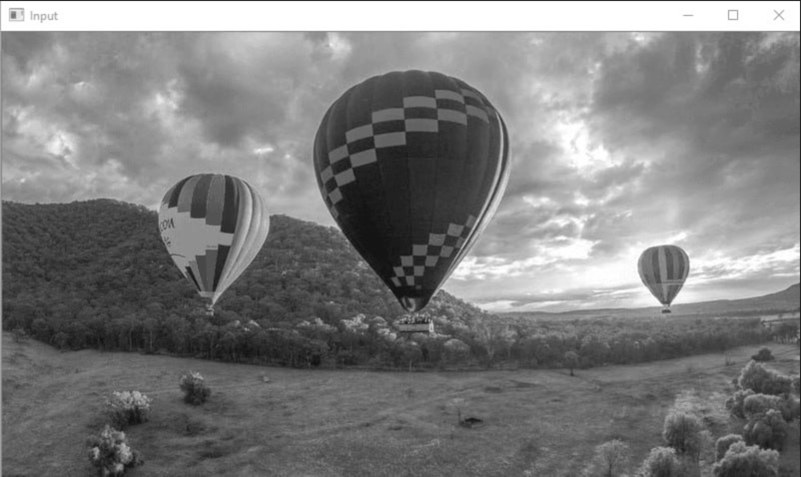

# Команда: 13  
Участники: Цыгляев Владислав, Габдрахманов Рустам, Лебедев Иван

Вариант: 13 mod 7 + 1 = 7  
Тема: Эрозия

# Источники

1) https://docs.opencv.org/3.4/db/df6/tutorial_erosion_dilatation.html

2) https://homepages.inf.ed.ac.uk/rbf/HIPR2/erode.htm

3) https://docs.opencv.org/3.4/d4/d86/group__imgproc__filter.html#gaeb1e0c1033e3f6b891a25d0511362aeb

4) https://ru.wikipedia.org/wiki/%D0%9C%D0%B0%D1%82%D0%B5%D0%BC%D0%B0%D1%82%D0%B8%D1%87%D0%B5%D1%81%D0%BA%D0%B0%D1%8F_%D0%BC%D0%BE%D1%80%D1%84%D0%BE%D0%BB%D0%BE%D0%B3%D0%B8%D1%8F#%D0%AD%D1%80%D0%BE%D0%B7%D0%B8%D1%8F

5) https://habr.com/ru/articles/113626/

# Теория

При выполнении операции эрозии ядро проходит по всем пикселям изображения. Если в некоторой позиции каждый единичный пиксель структурного элемента совпадет с единичным пикселем бинарного изображения, то выполняется логическое сложение центрального пикселя ядра с соответствующим пикселем выходного изображения. В результате применения операции эрозии все объекты, меньшие чем ядро, стираются, объекты, соединённые тонкими линиями становятся разъединёнными и размеры всех объектов уменьшаются.  

Основной эффект оператора на бинарном изображении — размывание границ областей пикселей переднего плана ( т. е. белых пикселей, как правило). Таким образом, области пикселей переднего плана уменьшаются в размерах, а отверстия внутри этих областей становятся больше.

Чтобы вычислить эрозию двоичного входного изображения этим структурирующим элементом, мы по очереди рассматриваем каждый из пикселей переднего плана во входном изображении. Для каждого пикселя переднего плана (который мы будем называть входным пикселем ) мы накладываем ядро поверх входного изображения так, чтобы центр ядра совпадал с координатами входного пикселя. Если для каждого пикселя в ядре соответствующий пиксель в изображении под ним является пикселем переднего плана, то входной пиксель остается таким, какой он есть. Однако, если какой-либо из соответствующих пикселей в изображении является фоном, входному пикселю также присваивается значение фона.

Пример работы эрозии бинарного изображения с ядром 3 на 3 изображен ниже.

Для цветного изображения или для оттенков серого вычисляется локальный минимум по площади заданного ядра.

Когда ядро сканируется по изображению, мы вычисляем минимальное значение пикселя, перекрываемое ядром и заменяем пиксель изображения под точкой привязки на это минимальное значение.

# Результаты работы

Бинарное изображение

- Original White-black

- Erosion cv2 White-black

- Erosion our algorithm White-black

Изображение в серых тонах

- Original Grey

- Erosion cv2 Grey

- Erosion our algorithm Grey

Цветное изображение

- Original

- Erosion cv2

- Erosion our algorithm

При сравнении работы Эрозии на изображениях выяснилось, что полученные изображения совпадают с большой точностью 

При оценке времени выполнения двух алгоритмов видно, что скорость реализации из OpenCV быстрее на несколько порядков

# Вывод

Был реализован алгоритм эрозии c ядром 3*3. Также было произведено сравнение с реализацией алгоритма из библиотеки OpenCV. Полученные изображения от двух алгоритмов идентичны с большой точностью. Скорость выполнения алгоритма OpenCV быстрее на несколько порядков.
