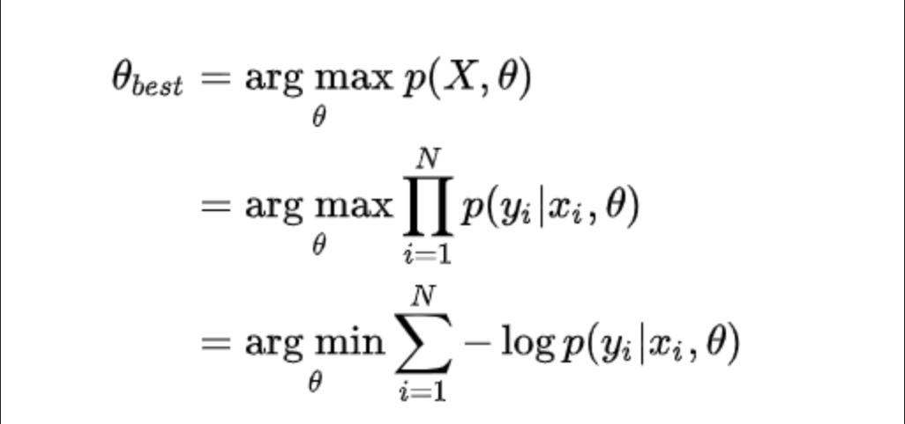

# Команда: 13  
Участники: Цыгляев Владислав, Габдрахманов Рустам, Лебедев Иван

# Источники

1) https://habr.com/ru/companies/skillfactory/articles/565232/

2) https://education.yandex.ru/handbook/ml/article/svyortochnye-nejroseti

3) https://habr.com/ru/companies/beelinekz/articles/646485/

4) https://en.wikipedia.org/wiki/LeNet

5) https://id-lab.ru/posts/developers/funkcii/

6) https://neurohive.io/ru/osnovy-data-science/glubokaya-svertochnaja-nejronnaja-set/

7) https://habr.com/ru/companies/ods/articles/714670/

8) https://habr.com/ru/companies/ods/articles/713920/

## Системы классификации изображений на основе сверточных нейронных сетей. 

# Теория

Свёрточная нейронная сеть (ConvNet/CNN) — это алгоритм глубокого обучения, который может принимать входное изображение, присваивать важность (изучаемые веса и смещения) аспектам или объектам изображении и отличать одно от другого.
в отличии от полносвязных нейронных сетей сети CNN способны с успехом схватывать пространственные и временные зависимости в изображении через применение соответствующих фильтров. Роль CNN заключается в том, чтобы привести изображения в форму, которую легче обрабатывать, без потери признаков, имеющих решающее значение в получении хорошего прогноза. Это важно при разработке архитектуры, которая не только хорошо изучает функции, но и масштабируется для массивных наборов данных.

*Слой свёртки - ядро*

Определенные ядра фильруют опредленные признаки и закономерности. При продвижении вглубь сети признаки изменяются от низкоуровневых(границы) до высокоуровневых(объекты).

Подобно свёрточному слою, слой объединения отвечает за уменьшение размера свёрнутого объекта в пространстве. Это делается для уменьшения необходимой при обработке данных вычислительной мощности за счёт сокращения размерности. Кроме того, это полезно для извлечения доминирующих признаков, которые являются вращательными и позиционными инвариантами, тем самым позволяя поддерживать процесс эффективного обучения модели.

# Датасет MNIST

Датасет MNIST содержит рукописные цифры. Загрузим датасет и создадим DataLoader-ы.

### Напишем свою CNN
Наша нейронная сеть (LeNet) будет состоять из
- Свёртки 3x3 (1 карта на входе, 6 на выходе) с активацией ReLU;
- MaxPooling-а 2x2;
- Свёртки 3x3 (6 карт на входе, 16 на выходе) с активацией ReLU;
- MaxPooling-а 2x2;
- Уплощения (nn.Flatten);
- Полносвязного слоя со 120 нейронами и активацией ReLU;
- Полносвязного слоя с 84 нейронами и активацией ReLU;
- Выходного слоя из 10 нейронов.

Будем использовать кроосэнтропию для многоклассовой классификации. В качестве метрики качества будем использовать accuracy, accuracy = correct_preds/all_preds

*Кроссэнтропия*

Обучим CNN

# Вывод

Была реализована простейшая система классификации изображений на основе
сверточных нейронных сетей. Также произведено обучения нейронной сети и представлены полученные метрики.